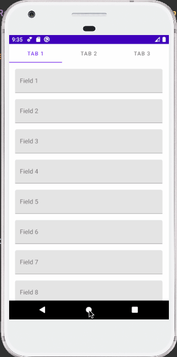

### Demo keyboard animation

## Installation
- Add lines below into your root build.gradle file
```
allprojects {
		repositories {
			...
			maven { url 'https://jitpack.io' }
		}
	}
```

- Add dependency
```
dependencies {
    implementation 'com.github.stevepham:keypod:$version'
}
```

[]
(https://jitpack.io/#stevepham/keypod)

## Documentation
# Tab 1/2
- Watch keyboard

# Tab 3
- Unwatch keyboard

# Usage
- Watch keyboard
```
Keyboard.watch(yourActivity)
```

- Unwatch keyboard
```
Keyboard.unwatch()
```

